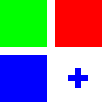

# Matrikx



Matriks 2.0.0 is an interactive grid and reticle customization application built using the ```customtkinter``` library. It is designed to provide a visually intuitive interface for creating, customizing, and visualizing grid-based canvases. The app supports a variety of configuration options, allowing users to tailor their workspace to their exact specifications.

## Features
### Grid Customization
- Toggle Grid Visibility: Easily enable or disable the grid display.
- Grid Color Options: Choose from a variety of grid colors, including red, green, blue, and grey.
- Grid Line Type: Switch between solid and dashed grid lines.
- Grid Divisions: Set the number of grid divisions to suit your needs, with options ranging from 5 to 35.
- Grid Intersections:
  - Enable or disable intersection markers.
  - Customize intersection marker color.
  - Adjust intersection marker size for better visibility.

### Reticle Customization
- Toggle Reticle Visibility: Enable or disable the central reticle.
- Reticle Color: Select from predefined colors such as red, green, blue, and white.
- Line Thickness: Adjust reticle line thickness from 1 to 8 for better clarity.
- Gap Size: Modify the gap between reticle lines for enhanced precision.

### Canvas Configuration
- Canvas Size: Select canvas dimensions, supporting sizes of ``400x400``, ``500x500``, or ``800x800`` pixels.
- Accent Color: Personalize the app’s UI with your preferred accent color.

### Dynamic Interaction
- The application dynamically updates the canvas to reflect user-selected configurations in real-time, providing an intuitive and seamless user experience.

### **Application**
This application is ideal for developers, designers, and educators who need a configurable grid environment for tasks such as alignment, spatial planning, or demonstrating concepts visually.

---
## Installation

1. Clone the repository:
   ```bash
   git clone https://github.com/PETROUNKNOWN/matrikx.git
   ```
2. Install the `customtkinter` library:
   
   ```
   pip install customtkinter
   ```
3. Run the `app.py` script to launch the application.
4. Use the side panel to customize the grid and reticle settings to your liking.

## Usage
Usage should be straightfoward.

## Queries
1. Reticle is not visible:
   
   - Check the `Grid Type`, ensure that it is not in `Solid`.
   - To circumvent this, simply increase the `Reticle Line Size` to a value bigger that 1.
   - This happens since the canvas overlays the grid lines above the reticle and since they have similar thickness, the reticle seems to disappear
     

## Contact
   ```
   what?
   ```
---
## Screenshots


